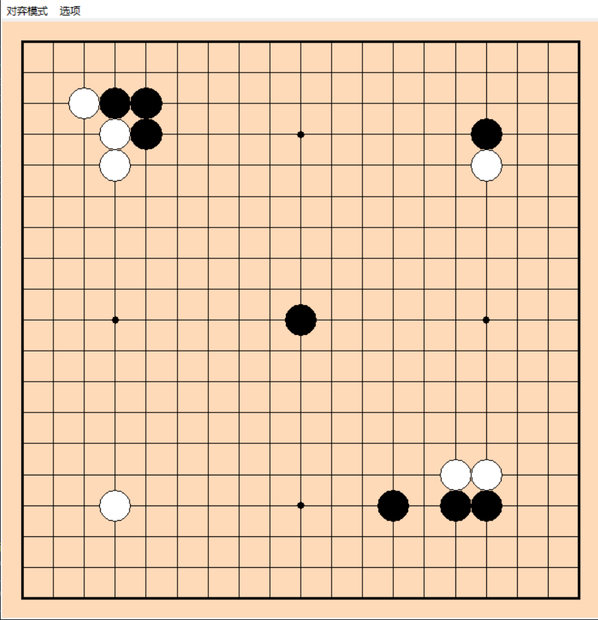

# Goplayer
一个python写的简单的围棋程序，使用Tkinter库

# 说明
这个项目是我大学入坑围棋时心血来潮写的，当时还有个用到Tkinter的作业，
但是写到吃子的洪水算法后就没再走下去，
我自己的围棋水平刚刚能比较容易的下赢棋弈无限的10K AI，
现在提前进组工作，用到Agent的知识，需要学习，
所以~~在摸鱼时~~加功能，用GPT去下棋，学习Agent的部署
~~Agent不用LLM输出，它会自己Call KataGo的tool来帮自己下棋~~

人机对战只是用来练习调用LLM API的，实际下棋不应该和GPT下，肯定下不过KataGo

~~都用KataGo还用Tkinter写的抽象围棋做什么~~

# 任务

- [x] 创建棋盘
- [x] 吃子
- [x] 判断输赢
- [x] 悔棋
- [x] 双人对弈
- [ ] 接入OpenAI 使用GPT对弈
  - [x] 使用openai对弈
  - [ ] 使用langchain结构化输出
  - [x] 异常处理，无效点重新生成
- [x] 随机对弈(随机数大战)
- [ ] 胜负判断
  - [x] 下到终局下无可下时数子判断
  - [ ] 势力估计(这个比较难，估计做不出来) 
- [ ] 特殊规则
  - [ ] 打劫 

# 界面
<!-- [游戏界面](./png/interface.png) -->

# 运行
python ItisMyGo.py

~~Go批是吧~~

# 输赢判断

目前还是通过数子法，需要下到终局，比较黑子数目-贴目数和白子数目哪个大

# [围棋入门规则](GoRules.md)