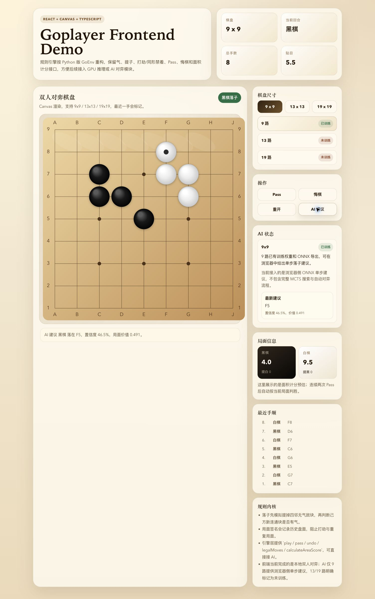
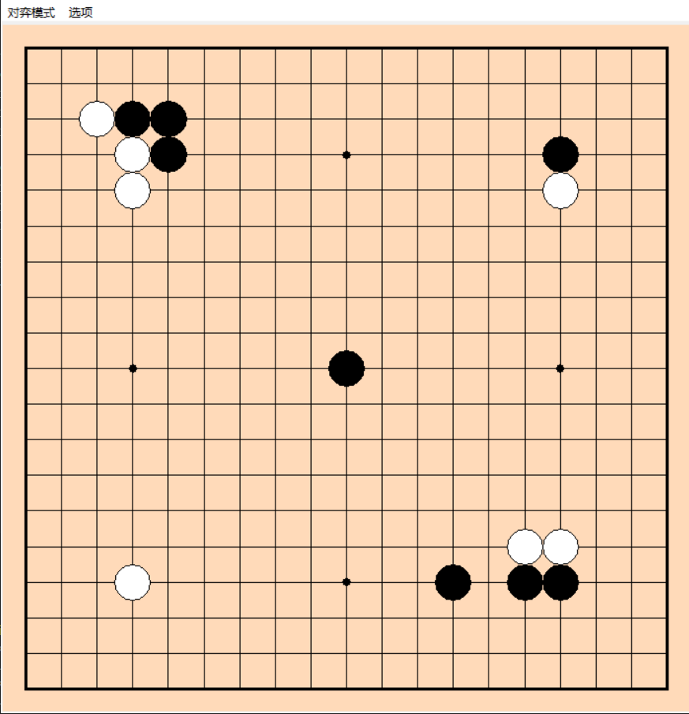

# GoPlay · Goplayer

一个围棋学习与实验项目：用 **React + Canvas** 在浏览器中对弈，用 **PyQt6** 运行桌面棋盘，用 **PyTorch + MCTS** 探索 AlphaZero 风格的自博弈训练。

支持 9 / 13 / 19 路棋盘。网页端已附带 **9 路 ONNX 模型**，可直接在浏览器中请求单步落子建议。

[快速开始](#快速开始) · [桌面版](#桌面版) · [训练与模型导出](#训练与模型导出) · [规则与限制](#规则与限制)

## 界面预览

### 网页版 · 9 路对弈与 AI 建议

以下为本地实际运行截图，展示落子、最近手顺、面积计分和 ONNX 建议。AI 建议需要手动落子，不会自动代下。



<details>
<summary>桌面版界面预览</summary>



该图展示桌面棋盘外观；当前版本还提供棋盘大小切换与本地 AlphaZero 模式，菜单以实际运行界面为准。

</details>

## 功能一览

| 功能 | 网页版 | 桌面版 / Python |
| --- | --- | --- |
| 9 / 13 / 19 路棋盘 | 支持 | 支持 |
| 本地双人对弈 | 支持 | 支持 |
| 提子、自杀禁着、同形禁着 | 支持 | 支持 |
| Pass、悔棋、面积计分 | 支持 | 支持 |
| AI 建议 | 9 路 ONNX 单步建议 | 本地网络 + MCTS 对弈 |
| 外部模型 API 对弈 | 无 | 支持 OpenAI 兼容接口 |
| 随机对弈 / 双 AI 观战 | 无 | 支持 |
| 自博弈训练 | 无 | PyTorch 策略 / 价值双头网络 |

13 / 19 路目前还没有训完，页面会显示“未训练”。项目定位为学习与实验，尚未提供棋力评级；训练脚本提供项目内部模型的交换执色评测。

## 快速开始

### 网页版

环境：**Node.js 22.12+、pnpm 10**。以下命令从项目根目录执行：

```bash
cd frontend
pnpm install --frozen-lockfile
pnpm dev
```

访问 **http://localhost:5173/Goplayer/**，实际端口以终端输出为准。

1. 点击棋盘交叉点落子，黑先、双方交替。
2. 点击 **AI 建议**，首次使用时加载模型与 WASM 运行时；仅 9 路可用。
3. 点击 **Pass** 停一手，连续两次 Pass 后按当前盘面计分。
4. **悔棋** 撤销上一手；**重开**或切换棋盘尺寸会清空当前对局。

检查和构建：

```bash
pnpm lint
pnpm build
pnpm preview
```

构建产物位于 `frontend/dist/`；预览地址通常为 `http://localhost:4173/Goplayer/`。

### GitHub Pages

仓库已有 [部署工作流](.github/workflows/deploy-gh-pages.yml)。

## 桌面版

环境：**Python 3.12+、uv**。在项目根目录运行：

```bash
uv sync --extra gui
uv run --extra gui python ItisMyGo.py
```

可选模式：**人人对弈、人机对弈、挑战 AlphaZero、AlphaZero vs AlphaZero、随机对弈**。通过菜单切换棋盘尺寸，或执行新游戏、停一手、认输、判断胜负与悔棋。

### 外部 API 对弈

在项目根目录创建 `.env`，参考 [.env.template](.env.template) 填写服务商配置：

```dotenv
OPENAI_MODEL="your-model"
OPENAI_API_KEY="your-key"
OPENAI_BASE_URL="https://your-provider.example/v1"
```

此模式会把棋盘状态发送给所配置的服务商，并可能产生 API 费用。网页端与本地 AlphaZero 模式不使用这些配置。

### 本地 AlphaZero 对弈

```bash
uv sync --extra gui --extra rl
uv run --extra gui --extra rl python ItisMyGo.py
```

默认按棋盘尺寸加载 `checkpoints/{size}x{size}/best_model.pth`，例如 `checkpoints/9x9/best_model.pth`。该目录被 Git 忽略，克隆仓库后需要自行训练或准备兼容权重；网页附带的 `.onnx` 文件不能直接替代桌面版 `.pth`。

缺少依赖、权重或权重尺寸不匹配时，当前实现会在终端输出原因，并回退到随机合法落子。

## 训练与模型导出

新增：**按局保存 SGF、终局棋盘与回放样本，固定数据的 20/80 次更新对照，以及独立的 Pass 输入实验**。具体命令、兼容约定和指标说明见 [训练实验指南](docs/training-experiments.md)。

### 在实验室 GPU 机器上运行

提供一份 [13 路实验配置](configs/train-13x13.json)，用于验证新的训练逻辑。以下命令在实验室机器上执行；这组参数尚未经过完整训练验证，不代表已解决棋力或收敛问题。

```bash
uv sync --extra rl
uv run --extra rl python scripts/train.py \
  --config configs/train-13x13.json \
  --run-name bs13_archive_v3 --iterations 10
```

先检查这 10 轮的终局、更新次数与第一次对局评测，再决定是否开始长实验。配置强制使用 CUDA；若当前 PyTorch 无法使用 CUDA，脚本会报错，需要先配置实验室环境。

```bash
uv run --extra rl python scripts/train.py \
  --config configs/train-13x13.json --run-name bs13_v2
```

第二条命令默认从头训练 400 轮，是一个新实验。每次运行需使用新名称；已有实验目录会被拒绝覆盖。若要从某个权重开始新实验，可传 `--init-checkpoint <path>`：**仅加载模型权重，不恢复优化器、回放池或随机状态**，不等同于断点续训。第一次排查建议从头训练，避免继承旧模型已经形成的偏差。

### 训练策略

- 自博弈根节点加入 Dirichlet 噪声，增加探索；评测和桌面对弈不加噪声。
- 策略监督使用归一化 MCTS 访问次数；落子采样单独调整温度，避免后期低温度把训练目标也压成近似 one-hot。
- 训练抽样时同步旋转 / 翻转棋盘与落子概率，共 8 种对称变换，Pass 概率不变。
- 只有连续两次 Pass 的终局生成胜负标签，和棋为 `0`。达到手数上限的对局单独计为截断，整局样本丢弃，不伪造胜负。
- 多局搜索的叶节点合并进行网络推理；搜索状态不复制 GUI 悔棋快照。规则计算仍在 CPU 串行执行，实际吞吐需在实验室测量。
- 默认 `stones-v1` 保留三通道输入、64 通道 / 3 个残差块；独立的 `pass-v2` 配置增加上一手 Pass 通道。旧权重与新输入版本不能混用。
- 所有已完成批次的对局归档到磁盘；约 10% 的整局数据留作验证，其余进入训练回放池。

| 参数 | 13 路配置 | 含义 |
| --- | --- | --- |
| `games_per_iteration` | 32 | 每轮自博弈局数 |
| `self_play_batch_size` | 16 | 同时推进的对局数，影响推理批大小 |
| `num_simulations` | 320 | 每步搜索预算，首次模拟用于展开根节点 |
| `batch_size` | 256 | 梯度更新时的回放样本批大小 |
| `train_steps_per_iteration` | 20 | 每轮梯度更新次数；样本不足时跳过 |
| `temperature_moves` / `final_temperature` | 80 / 0.25 | 前 80 手温度为 1，之后降低采样温度 |
| `min_moves_before_pass` / `max_moves` | 100 / 676 | 前 100 手限制 Pass；无合法落点时仍允许 Pass |
| `dirichlet_alpha` / `noise_fraction` | 0.06 / 0.25 | 根节点探索噪声参数 |
| `eval_interval` / `eval_games` | 10 / 20 | 每 10 轮分别对固定参考模型和当前最佳模型各评测 20 局 |

配置优先级为 **命令行 > JSON > 支持的环境变量 > 内置默认值**。不使用 JSON 时，9 / 13 / 19 路的搜索预算分别为 160 / 320 / 640，温度切换手数为 40 / 80 / 120，Pass 限制手数为 50 / 100 / 180。完整参数：

```bash
uv run --extra rl python scripts/train.py --help
```

13 路仍使用项目原有的 **2.0 目**贴目；整数贴目可能产生和棋。可用 `--komi` 单独开展对照实验，但训练、评测和最终使用模型时应采用相同贴目。网页和桌面默认贴目不会随训练参数自动改变。

### 模型选择与实验记录

评测采用固定随机种子的成对开局，每个开局交换候选模型的执色，不加探索噪声，按最大访问概率落子。和棋计半分；当全部评测局正常终局且候选模型对当前最佳模型的得分率达到 55%，才更新 `best_model.pth`。20 局只能粗略筛选；要确认提升，应增加评测局数（例如 `--eval-games 100`）并用其他开局复测。

```text
checkpoints/13x13/<run_name>/
├── initial_model.pth      # 固定数据更新对照的共同起点
├── reference_model.pth    # 固定参考，默认是本轮实验的初始模型
├── best_model.pth         # 初始为基线；通过交换执色评测后才更新
├── latest_model.pth       # 最近一次保存的训练模型
└── model_v10.pth          # 按保存间隔留存的模型
logs/13x13/<run_name>/
├── run_config.json        # 最终参数、Git 版本、设备与 PyTorch 版本
├── train_metrics.csv
├── selfplay_games.jsonl
├── evaluation.jsonl       # 对参考 / 最佳模型的成绩，含黑白分项
├── evaluation_games.jsonl # 每局终止原因、分数、逐手记录和终局棋盘
├── evaluation_sgf/        # 评测棋谱
├── data/                  # 按局的 SGF / JSON / NPZ 归档及固定训练/验证划分
└── events.out.tfevents.*  # 启用 TensorBoard 时生成
```

`--checkpoint-dir`、`--log-dir` 是根目录，都会追加棋盘尺寸和运行名称。固定参考不会随晋级更新，可通过 `--eval-opponent <path>` 指定兼容的旧模型；否则“击败参考模型”仅表示击败实验初始模型，不是棋力评级。

排查“一边倒”时重点看：

| 记录 | 如何使用 |
| --- | --- |
| `truncation_rate`、`completed` | 截断超过 25% 会告警；大量未终局样本被丢弃，应先检查终局与手数上限 |
| `target_entropy`、`policy_kl`、`val_*` | 同一批次目标熵与策略 KL，以及独立验证集指标；详细解释见训练实验指南 |
| `buffer`、`optimizer_steps` | 更新次数为 0 表示尚未满足训练批大小，loss 空值不是 loss 为 0 |
| `black_score_rate`、`mean_score_diff_completed` | 只统计正常终局；不能要求自博弈黑白胜率必然各 50% |
| `mean_policy_entropy`、`mean_policy_max` | 结合棋局长度观察策略是否过早集中到少数落点 |
| `mean_root_value_black` / `white` | 分别观察当前执子方价值是否长期饱和 |
| 评测的 `score_as_black` / `score_as_white` | 检查提升是否只发生在一种执色；同时看截断数，避免误读总体得分 |
| `positions_per_second` | 自博弈实际落子吞吐，含规则与搜索耗时，不是神经网络每秒推理次数 |

```bash
uv run --extra rl tensorboard --logdir logs
```

环境变量及桌面权重设置见 [.env.template](.env.template)。使用新实验的桌面模型时显式设置：

```dotenv
ALPHAZERO_CHECKPOINT_PATH="checkpoints/13x13/bs13_v2/best_model.pth"
```

### 导出到浏览器

确认候选模型通过评测后再导出：

```bash
uv run --extra rl python scripts/export_onnx.py \
  --checkpoint checkpoints/13x13/bs13_v2/best_model.pth
```

三通道模型生成 `frontend/public/models/13x13/goplayer_v1.onnx`，四通道 Pass 模型生成 `goplayer_v2.onnx`，同时输出同名 `.json` 元数据并检查 ONNX 格式。宽度、深度和输入版本从权重自动识别；可选的 `--num-channels` 和 `--num-res-blocks` 参数用于核对形状。

不同棋盘尺寸需要分别训练。导出 13 / 19 路模型后，还需要修改 [modelConfig.ts](frontend/src/game/modelConfig.ts) 中对应尺寸的 `trained`、`modelPath` 和说明文字，前端才会启用 AI 按钮。网页仅使用策略网络单步推理，实际表现需要另外检验。

## 规则与限制

- 落子后先提掉无气敌块，再判断己方是否有气；禁止自杀着。
- 使用棋盘历史签名检查 **Positional Superko（全局同形禁着）**。
- 连续两次 Pass 终局，按盘上棋子与单色围住的空点进行面积计分。不会自动识别或移除死子，应先完成争议区域的对弈。
- 默认白方贴目：9 路 **5.5**、13 路 **2.0**、19 路 **7.5**；同分判和棋。
- 网页 AI 使用策略网络单次推理，不含 MCTS。界面的“置信度”是合法候选着法中的策略概率，不代表胜率；价值输出也未经棋力校准。
- 网页对局保存在内存中，刷新页面会丢失，尚无棋谱导入 / 导出与在线联机功能。

规则背景见 [GoRules.md](GoRules.md)。

## 项目结构

```text
ItisMyGo.py               桌面版入口
src/Goplayer/            Python 规则环境、棋盘与棋手
src/rl/                  编码器、网络、批量 MCTS、自博弈 / 评测、数据增强、回放缓冲
configs/train-13x13.json  13 路 GPU 实验配置
scripts/train.py         自博弈训练与实验记录
scripts/compare_updates.py 固定数据的更新次数对照
scripts/export_onnx.py   模型导出
docs/training-experiments.md 实验室运行与数据复用指南
frontend/src/            React 页面、Canvas 棋盘、TypeScript 规则引擎
frontend/public/models/ 浏览器模型与元数据
docs/screenshots/        界面截图
tests/                   Python 规则、AI 与 Qt 线程回归测试
frontend/tests/          前端 AI 异步请求回归测试
```

## 回归测试

前端（在 `frontend/` 中运行）：

```bash
pnpm test
pnpm lint
pnpm build
```

Python（在项目根目录运行，需要 GUI 与训练依赖）：

```bash
uv run --extra gui --extra rl python -m unittest discover -s tests -v
```

测试覆盖规则与和棋、API 坐标转换、Qt 线程、网页过期 AI 请求，以及根节点噪声、批量搜索、策略目标、数据对称变换、回放抽样、截断标签和成对评测。训练策略测试使用固定局面、预设策略与模拟更新，不执行真实梯度更新；还会验证归档读回、输入版本兼容、验证集不修改权重，以及三 / 四通道 ONNX 与 PyTorch 输出一致。外部 API 使用模拟响应。
